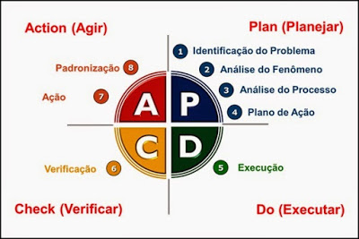
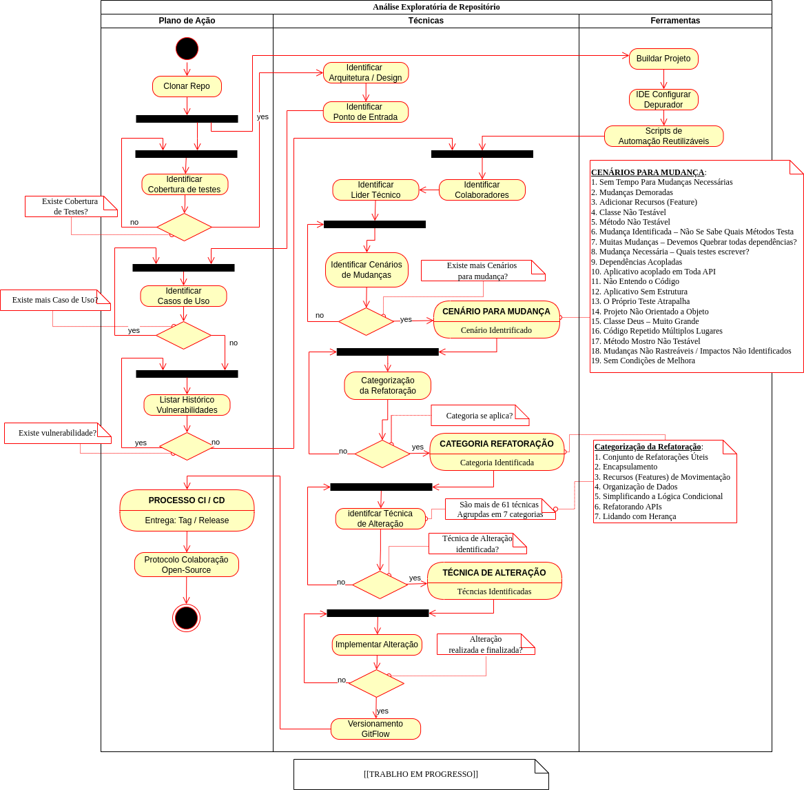

# Módulo Gestão Usuários - Autenticação e Autorização (Angular)

Projeto para evidenciar habilidades técnica na criação de um módulo de gestão de usuários básicos para autenticação e autorização e  desafio técnico na(s) empresa(s) [AcmeCorp](https://acmecorp.com.br/about).

_**IMPORTANTE**_: Assumiremos aqui a mentalidada: **Feito é melhor que Perfeito!**


## 🚀 Começando

Essas instruções permitirão que você obtenha uma cópia do projeto em operação na sua máquina local para fins de desenvolvimento e teste.


### 📋 Pré-requisitos

Assumindo que vocês estejam usando máquina virtua com o SO Fedora 35+
Antes de baixar o presente projeto devemos ter as seguintes ferramentas:

```

	##############################################
	# Instalação do NodeJS no Fedora
	##############################################
	 sudo dnf install nodejs.x86_64
	 node -v
	##############################################

	##############################################
	# Instalação da Ferramenta Node.Js Version Manager
	##############################################
	 curl -o- "https://raw.githubusercontent.com/nvm-sh/nvm/${NVM_VERSION}/install.sh" | bash
	 node -v
	##############################################

	##############################################
	# Instalação do Angular CLI
	##############################################

    export NODE_VERSION="v20.12.1"
    export NVM_VERSION="v0.39.3"
    export NG_CLI_VERSION="17.3.3"

	  nvm install "${NODE_VERSION}"
	  nvm use "${NODE_VERSION}"

	  npm install -g "@angular/cli@${NG_CLI_VERSION}"
    ng version
    
	##############################################

```

#### Aplicação Backend

Para o presente projeto será necessário que esteja executando o projeto [Módulo Gestão Usuários - Autenticação e Autorização (JWT + Spring Security)](https://github.com/pssilva/backend-sp-acmecopr-mod-users?tab=readme-ov-file#m%C3%B3dulo-gest%C3%A3o-usu%C3%A1rios---autentica%C3%A7%C3%A3o-e-autoriza%C3%A7%C3%A3o-jwt--spring-security):

```bash

mkdir -p "${HOME}/projetos"
cd "${HOME}/projetos"

export ARTIFACT_ID="backend-sp-acmecopr-mod-users"
export WORK_PATH="${HOME}/projetos/${ARTIFACT_ID}"

cd "${WORK_PATH}"
git clone "https://github.com/pssilva/${ARTIFACT_ID}.git"
source ~/.bash_profile
idea .

```

##### Iniciando Backend

```bash

export ARTIFACT_ID="backend-sp-acmecopr-mod-users"
export WORK_PATH="${HOME}/projetos/${ARTIFACT_ID}"

cd "${WORK_PATH}"
mvn clean install
java -jar target/backend-sp-acmecopr-mod-users-0.0.1-SNAPSHOT.jar 

```


### 🔧 Instalação

Depois de instalar [as ferramentas do Pré-requisito](#-pré-requisitos), execute os seguintes comandos: 

```bash
mkdir -p "${HOME}/projetos"
cd "${HOME}/projetos"

export ARTIFACT_ID="frontend-angular-acmecorp-mod-users"
export WORK_PATH="${HOME}/projetos/${ARTIFACT_ID}"

cd "${WORK_PATH}"
git clone "https://github.com/pssilva/${ARTIFACT_ID}.git"
source ~/.bash_profile
idea .

```

#### Iniciar Apliação

Executes os seguintes comandos:

```bash
export ARTIFACT_ID="frontend-angular-acmecorp-mod-users"
export WORK_PATH="${HOME}/projetos/${ARTIFACT_ID}"

cd "${WORK_PATH}"
nvm use --lts
npm run start

```

Depois de iniciar a aplicação pela IDE acesso o Swagger UI no sequinte link: http://localhost:4200/


---

## Template HTML AdminLTE

<a href="https://github.com/ColorlibHQ/AdminLTE?tab=readme-ov-file#adminlte---bootstrap-5-admin-dashboard"></a>


---


## Proficiências

Procuro evidência as proficiências nas seguintes habilidades técnicas:

- [Metodologia Básica de Análise de Algoritmos](#GOODRICH-Michael-T)
- Aplica [Abordagem API First](https://swagger.io/resources/articles/adopting-an-api-first-approach/) com foco em: [Os Doze Fatores](https://12factor.net/pt_br/)
  - Artefato: `src/main/resources/static/swagger.yaml`
- Técnicas em [Análise Código-fonte Legados](#FEATHERS-michael);
- Técnicas em [Refatoração Código-fonte Legados](#FEATHERS-michael) e de Projeto Open Source:
  - Framework Spring
    - [Spring Boot 3+](https://spring.io/blog/2022/05/24/preparing-for-spring-boot-3-0)
    - [Spring Security](https://spring.io/projects/spring-security)
    - [Spring Batch](https://docs.spring.io/spring-batch/docs/3.0.x/reference/html/spring-batch-intro.html);
- Implantação de Soluções [Sem Servidores em multiplas nuvens](STIGLER-Maddie);
- Integração com front-end usando padrão BFF [Angular Framework](https://angular.io/);

Projeto inicializado com o [`Scripts de automação próprio`]().

---
## 🔩 Débitos Técnicos

Segue abaixo (não se limita) os problemas identificados até o momento.
Aqui temos uma lista do que idenficamos com status de pendente:

- [ ] Reset de senha com email
- [ ] Organização dos Pastas dos componetes adaptados ao [Templante AdminLTE](#template-html-adminlte)
- [ ] Cadastro do Usuário com o seu respectivo Grupo de Acesso (Rules)

## 📦 Desenvolvimento

### Funcionalidades Aplicação

Segue abaixo (não se limita) os objetivos do presente projeto:

- [X] ~~Formatando documentação README.md~~
- [X] ~~Documentação Elaboração do Diagrama de Atividade da Análise Exploratória Genérico.~~
- [ ] Refatorar componentes com os dados do usuário logado:
  - [ ] Componente SiderBar: `app/components/app-header/app-sidebar.component.ts`
  - [ ] Componente AppHeader: `app/components/app-header/app-header.component.html`
- [ ] Gerenciando Estados com NgRx
  - [ ] Escrever Ações
  - [ ] Escrever Efetios
  - [ ] Escrever Redutores
- [ ] Scripts Automação
  - [ ] Geração dos Artefatos de Caso de Uso por linha de comando
  - [ ] Funcionalidades de notificações de mensagens de erro
- [ ] Cobertura de Testes
  - [ ] TDD - Técnica: Red-Green-Refactory para cada Caso de Uso da aplicação:
    - [ ] Caso de Uso: Autenticação | Autorização
    - [ ] Caso de Uso: Gestão Usuários: Artefato: ``
- [ ] Telas para atender os Endpoints (Operações CRUD)
  - [X] UI Registro de Usuário (Create - CRUD)
  - [X] UI Login de Usuário (Read - CRUD)
  - [X] UI Usuário (Delete - CRUD)
  - [ ] UI Notificação Modal
  - [ ] UI Navegar Listagem com paginação (Read - CRUD)
  - [ ] Update - CRUD 
- [ ] Realizar [Análise Exploratória](#da-analise-exploratoria) dos seguintes projetos Open-Source: 
  - [ ] [AdminLTE (v3.2.0)](https://github.com/ColorlibHQ/AdminLTE/releases/tag/v3.2.0)

### Indexação de Vídeos

- [ ] Indexação completa do vídeo longo: 
  - [X] ~~[PLAYLIST 163 vídeos  – 03.04.07.12.09 – Curso de Angular – Loiane Groner – Questões](repo-docs/indexacoes/PLAYLIST%20163%20vídeos%20%20–%2003.04.07.12.09%20–%20Curso%20de%20Angular%20–%20Loiane%20Groner%20–%20Questões.pdf)~~. Indexação incompleta! Trabalho em progresso e sempre revisitando para atualização dos conceitos para as novas versões do Angular!! (Mais de talhes [veja aqui](repo-docs/indexacoes/README.md))
  - [X] ~~[PLAYLIST 58 vídeos – 03.04.07.12.09 – CRUD Angular + Spring – Questões](repo-docs/indexacoes/PLAYLIST%2058%20vídeos%20–%2003.04.07.12.09%20–%20CRUD%20Angular%20+%20Spring%20–%20Questões.pdf)~~. Playlist totalmente indexada e relacionada com os questionários de contextos! (Mais de talhes [veja aqui](repo-docs/indexacoes/README.md))
  - [ ] [VIDEO LONGO 5819 – 03.04.07.18.02.41.09 – PROJETO FULLSTACK COM LOGIN USANDO SPRING SECURITY + JWT | BACKEND – Fernanda Kipper | Dev – Questões](VIDEO%20LONGO%205819%20–%2003.04.07.18.02.41.09%20–%20PROJETO%20FULLSTACK%20COM%20LOGIN%20USANDO%20SPRING%20SECURITY%20+%20JWT%20|%20BACKEND%20–%20Fernanda%20Kipper%20|%20Dev%20–%20Questões.pdf). Indexação incompleta! Trabalho em progresso e sempre revisitando para atualização dos conceitos para aplicar a técnica de revisão espaçada! (Mais de talhes [veja aqui](repo-docs/indexacoes/README.md))
  - [ ] [VIDEO LONGO 11552 – 03.04.07.18.02.41.09 – Autenticação e Autorização com Spring Security, JWT Tokens e Roles – Questões](VIDEO%20LONGO%2011552%20–%2003.04.07.18.02.41.09%20–%20Autenticação%20e%20Autorização%20com%20Spring%20Security,%20JWT%20Tokens%20e%20Roles%20–%20Questões.pdf). Indexação incompleta! Trabalho em progresso e sempre revisitando para atualização dos conceitos para aplicar a técnica de revisão espaçada! (Mais de talhes [veja aqui](repo-docs/indexacoes/README.md))

### Atividades - DevOps

- [ ] Conteinerização Docker | Kubernetes 
- [ ] Implementação dos Pipelines CI/CD de Implatação num Provedor de Nuvem.
- [ ] Implementar restrições de Commit no Git: vinculado com o ID de regra de negócio e ID do checklist de validação das entragas de funcionalidades (mais detalhes [aqui](repo-docs/checklists/README.md))

### Segurança
- [X] ~~Geração Token JWT: Autenticação e Autorização no Backend~~
- [ ] Mapear o uso do ControllerAdvice tratar as Excessões
- [ ] [Spring Boot externalized configuration](https://docs.spring.io/spring-boot/reference/features/external-config.html): Externalização das configurações dos parâmetros de uma aplicação

### Desacoplamento Regras de Negócios

- [ ] Catalogação das Regras Funcionais (RNFs): Identificação das parametrições: [Formato JSON](repo-docs/rnfs/rnfs.json)

---
## 🛠️ Construído com

Seque aqui as ferramentas utilizadas na construção presente projeto: 

* [Spring Boot 3+](https://spring.io/blog/2022/05/24/preparing-for-spring-boot-3-0)
* [Spring Security](https://spring.io/projects/spring-security)
* [JavaServer Pages (JSP)](https://download.oracle.com/otn-pub/jcp/jsp-2_3-mrel2-eval-spec/JSP2.3MR.pdf?AuthParam=1714762870_4a98d638ea0d5173327d5a911bed87f6)
* [Bootstrap 5+](https://getbootstrap.com/repo-docs/5.3/examples/)

* [Docker](https://www.docker.com/get-started/)
* [Maven](https://maven.apache.org/) - Gerente de Dependência
* [Terminal Shell Linux (WSL)](https://learn.microsoft.com/pt-br/windows/wsl/install)
* [SDKMAN CLI](https://sdkman.io/)


### Mentalidade PDCA

Tendo em mente que sempre buscamos melhorar o protocolo de trabalho operacinal do dia a dia usando empirismo (colocar realmente em prática os conheicmentos abstratos)

NOTA: Não se trata de ficar ditando regras no trabalho da equipe, mas sim melhorar o [meu operacional pessoal de trabalho](#da-analise-exploratoria) e com isso agregar valor melhorando a perfomance:



--- 

<a href="#FOWLER-Martin" id="da-analise-exploratoria">

</a>

---

## Referências Usadas

Seque abaixo as referências bibliográficas usadas no presente projeto:

### Livros

---

<p align="justify">
[<a id="FEATHERS-michael">MARTIN, Robert C. | FEATHERS Michael</a>]: Working Effectively with Legacy Code. Library of Congress Cataloging-in-Publication Data: 2004108115 Copyright © 2005 Pearson Education, Inc. Prentice Hall Professional Technical Reference Upper Saddle River, NJ 07458. ISBN 0-13-117705-2 (Robert C. Martin Series, número). Disponível em: < <a href="https://a.co/d/3RZL8Sl">https://a.co/d/3RZL8Sl</a> >. Acesso em: 16 Mai. 2024.
</p>

---

<p align="justify">
[<a id="GOETZ-Brian">GOETZ ,Brian; PEIERLS ,Tim; BLOCH, Joshua et al</a>]. Java Concurrency in Practice. 1 Ed. Addison-Wesley Professional; 1st edition (May 9, 2006). 432 pages. (Nome da série e/ou coleção, 978-0-321-34960-6). Disponível em: < <a href="https://a.co/d/4T05Xuz"> https://a.co/d/4T05Xuz </a> > . Acesso em: dia 12 jun. 2024.
</p>

---

<p align="justify"> 
[<a id="SELIKOFF-Scott">SELIKOFF, Scott; BOYARSKY, Jeanne</a>]. OCP Oracle® Certified Professional Java SE 17 Developer Study Guide Exam 1Z0-829 1 Ed. Cidade da publicação: Editora, ano de publicação. 1056 páginas. 1 Ed. (Nome da série e/ou coleção, 978-1119864585). Disponível em: < <a href="https://a.co/d/08ATqoe7">https://a.co/d/08ATqoe7 </a> >. Acesso em: 03 jul. 2024.
</p>

---

<p align="justify">
<a id="Spring-Boot-and-Angular"></a>
[DULDULAO, Devlin Basilan, VILLAFRANCA], Seiji Ralph. [<a href="https://a.co/d/htReU6n">Spring Boot and Angular: Hands-on full stack web development with Java, Spring, and Angular</a>]. 1 Ed. Birmingham B3 2PB, UK.: Packt Publishing, Copyright © 2022. 438 p. (Nome da série e/ou coleção, ISBN 978-1-80324-321-4). Disponível em: < <a href="https://a.co/d/htReU6n">https://a.co/d/htReU6n</a> >. Acesso em: 29 mai.2024.
</p>

---

<p align="justify">
[<a id="STIGLER-Maddie">STIGLER, Maddie</a>]. <a href="https://a.co/d/7tIdtSM">Beginning Serverless Computing Developing with Amazon Web Services: Microsoft Azure, and Google Cloud. 1 Ed. Richmond, Virginia, USA</a>. Editora: Apress; 1st ed. edição (25 novembro 2017). Copyright © 2018 by Maddie Stigler. 199 páginas. (Nome da série e/ou coleção, ISBN-13 (pbk): 978-1-4842-3083-1). Disponível em: < <a href="https://a.co/d/7tIdtSM">https://a.co/d/7tIdtSM</a> >. Acesso em: 24 jul. 2024.
</p>

---

### Vídeos / Playlists

---

<p align="justify">
[<a id="O-QUE-VOCÊ-DEVERIA-SABER-SOBRE-SPRING-BATCH">O QUE VOCÊ DEVERIA SABER SOBRE SPRING BATCH?</a>] Direção: Vídeo de apresentação teórica de sistemas batch / spring batch. Produção: Feito pelo canal do youtube @DevsJavaGirlBR. Realização: Fito pelo canal do youtube @DevsJavaGirlBR. Roteiro: Feito pela Giuliana Bezerra (@giulianabezerra). Fotografia: N/A. Intérpretes: N/A. Local: Vídeo postado na plataforma do Youtuve, 29 de ago. de 2020.  Indicação do suporte físico e duração entre parênteses, demais características (stream, som, cor, legenda, tradução, stream). Disponível em: < <a href="https://www.youtube.com/live/ACaKKm00Tts?si=trRz0HB4EJXkjV7o"> https://www.youtube.com/live/ACaKKm00Tts?si=trRz0HB4EJXkjV7o </a> >. Acesso em: 8 jun. 2024
</p>

---

<p align="justify">
[<a id="CURSO-MULTITHREAD-Paralelismo-Concorrência-com-Java">CURSO MULTITHREAD, Paralelismo e Concorrência com Java.</a>] Direção: Reinaldo (@rinaldodev). Produção: Reinaldo (@rinaldodev). Realização: Reinaldo (@rinaldodev). Roteiro: Reinaldo (@rinaldodev). Fotografia: N/A. Intérpretes: N/A; Reinaldo (@rinaldodev). Local: Playlist produzida na plataforma do youtube, 22 de out. de 2020. Indicação do suporte físico e duração entre parênteses, demais características (tipo stream, som, cor, legenda, tradução, tipo stream). Disponível em: < <a href="https://youtube.com/playlist?list=PLuYctAHjg89YNXAXhgUt6ogMyPphlTVQG&si=dbt3IMMis_sXcCCP"> https://youtube.com/playlist?list=PLuYctAHjg89YNXAXhgUt6ogMyPphlTVQG&si=dbt3IMMis_sXcCCP</a> >. Acesso em: 3 jun. 2024.
</p>

---

<p align="justify">
[<a id="CRUD-ANGULAR-+-SPRING">CRUD ANGULAR + SPRING</a>]. Direção: Loiane Groner. Produção: Loiane Groner. Realização: Loiane Groner. Roteiro: Loiane Groner. Fotografia: N/A. Intérpretes: N/A; Loiane Groner. Local: Produzido no canal de stream Youtube,  5 de jul. de 2016 (há mais de 7 anos). Indicação do suporte físico e duração entre parênteses, demais características (tipo de sinal se vídeo, som, cor, legenda, tradução, tipo de película). Disponível em: <  <a href="https://www.youtube.com/playlist?list=PLGxZ4Rq3BOBpwaVgAPxTxhdX_TfSVlTcY">https://www.youtube.com/playlist?list=PLGxZ4Rq3BOBpwaVgAPxTxhdX_TfSVlTcY</a> >. Acesso em: 29 mai. 2024.
</p>

NOTA: para deixar evidenciado, segue a [indexação da playlist](./repo-docs/indexacoes/README.md) (se trata de um questionário com o mapeamento do link de um tema / assunto no momemento onde se explica um conceito ou uma técnica de codificação).

---

<p align="justify">
[<a id="CURSO-DE-ANGULAR">CURSO DE ANGULAR]</a>. Direção: Loiane Groner. Produção: Loiane Groner. Realização: Loiane Groner. Roteiro: Loiane Groner. Fotografia: N/A. Intérpretes: N/A; Loiane Groner. Local: Produzido no canal de stream Youtube,  5 de jul. de 2016 (há mais de 7 anos). Indicação do suporte físico e duração entre parênteses, demais características (tipo de sinal se vídeo, som, cor, legenda, tradução, tipo de película). Disponível em: <  <a href="https://youtube.com/playlist?list=PLGxZ4Rq3BOBoSRcKWEdQACbUCNWLczg2G&si=9ETFjwYZsV1ed7bU"> https://youtube.com/playlist?list=PLGxZ4Rq3BOBoSRcKWEdQACbUCNWLczg2G&si=9ETFjwYZsV1ed7bU</a> >. Acesso em: 29 mai. 2024.
</p>

---

